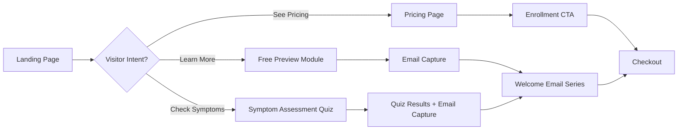
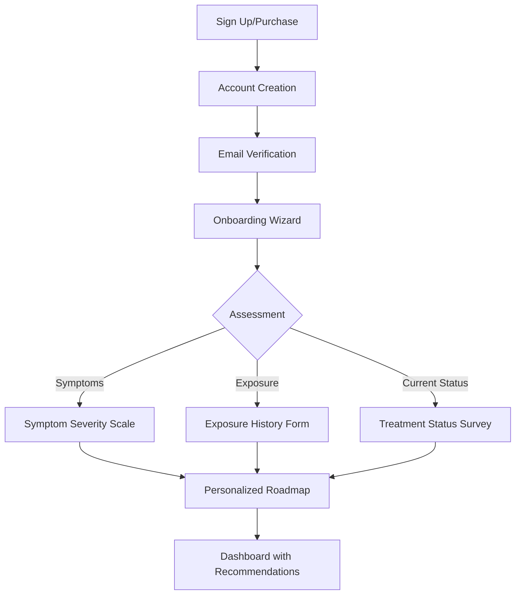
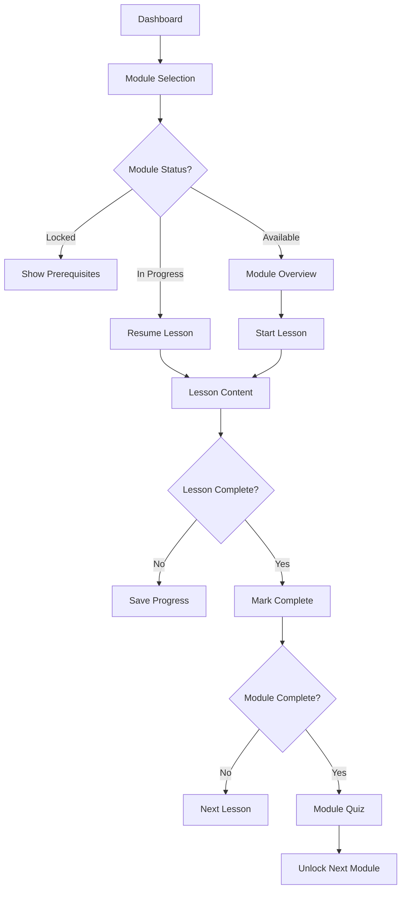
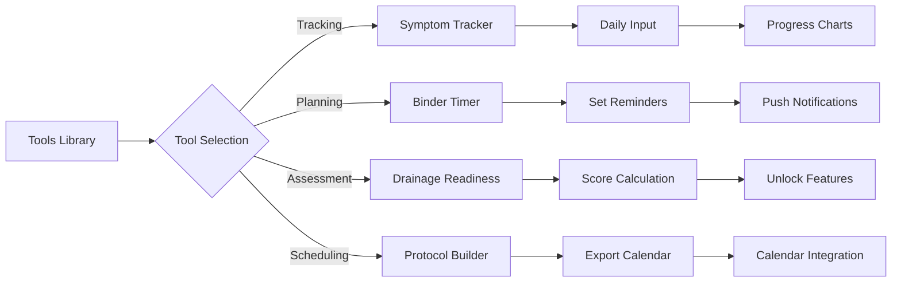
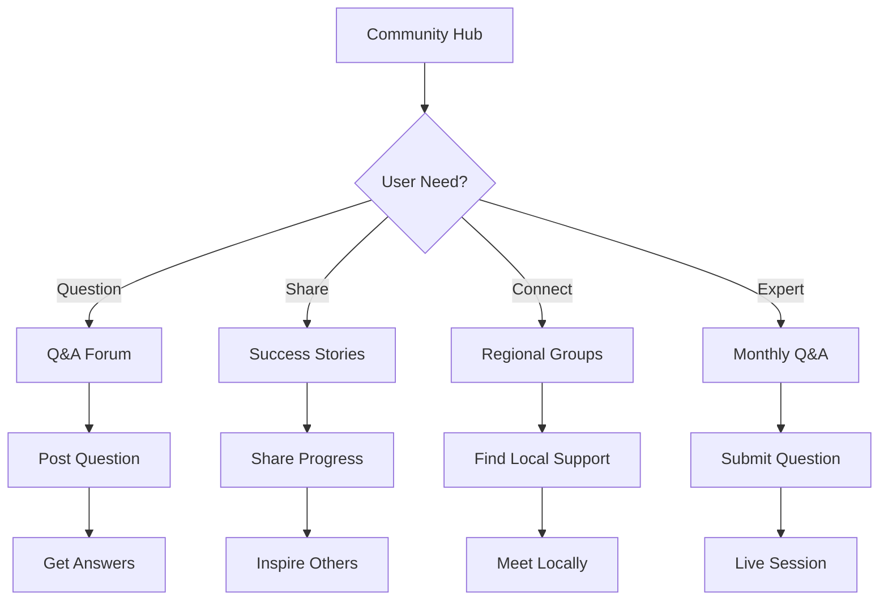
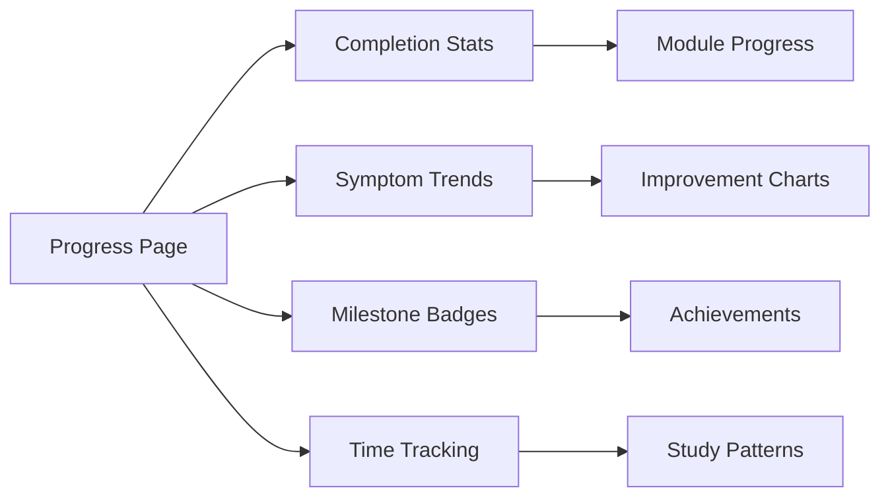

# User Flow - Mold Detox Mastery Platform

## Overview
This document maps all user journeys through the Mold Detox Mastery online course platform, from initial discovery through course completion and ongoing support.

## Primary User Flows

### 1. Landing & Discovery Flow

**Key Pages:**
- `/` - Landing page with value proposition
- `/preview` - Free module preview (Module 1: Understanding Mold)
- `/quiz` - Interactive symptom assessment
- `/pricing` - Tiered pricing options
- `/testimonials` - Success stories
- `/about` - Creator story and credentials

**User Actions:**
- Take symptom assessment quiz
- Watch free preview content
- Download free resources (with email capture)
- Read testimonials and success stories
- Compare pricing tiers
- Start enrollment process

### 2. Authentication & Onboarding Flow

**Key Pages:**
- `/auth/signup` - Account registration
- `/auth/signin` - Member sign in
- `/auth/verify` - Email verification
- `/onboarding` - Initial assessment wizard
- `/onboarding/symptoms` - Symptom checklist
- `/onboarding/exposure` - Exposure assessment
- `/onboarding/goals` - Recovery goals setting

**Personalization Data Collected:**
- Primary symptoms and severity
- Exposure history (home/work/duration)
- Previous treatments tried
- Budget constraints
- Available equipment (sauna access, etc.)
- Dietary restrictions
- Time availability for protocols

### 3. Core Learning Flow

**Key Pages:**
- `/dashboard` - Personal progress dashboard
- `/modules` - All modules overview
- `/modules/[id]` - Individual module page
- `/modules/[id]/lessons/[id]` - Lesson content
- `/tools` - Interactive tools library
- `/resources` - Downloadable resources

**Module Progression (Gated):**
1. Quick Start Guide (Always Available)
2. Understanding Mold Exposure (Unlocked on enrollment)
3. Testing & Diagnosis (Complete Module 2)
4. Opening Drainage Pathways (Complete Module 3 + 7-day wait)
5. Binders Protocol (Drainage Readiness Score ≥ 80%)
6. Antifungals (Complete Binders + Tolerance Check)
7. Managing Herx Reactions (Available with Module 5)
8. Supportive Therapies (Available with Module 5)
9. Diet & Nutrition (Always Available)
10. Prevention & Maintenance (50% Total Completion)

### 4. Interactive Tools Flow

**Interactive Tools:**
- `/tools/symptom-tracker` - Daily symptom logging
- `/tools/drainage-readiness` - Readiness calculator
- `/tools/binder-planner` - Medication timing tool
- `/tools/herx-toolkit` - Reaction management guide
- `/tools/diet-builder` - Meal planning tool
- `/tools/retest-scheduler` - Lab test reminders
- `/tools/exposure-checklist` - Home assessment

**Tool Features:**
- Auto-save progress every 30 seconds
- Visual progress indicators
- Export to PDF/Calendar
- Mobile-responsive design
- Offline capability for trackers

### 5. Community & Support Flow

**Key Pages:**
- `/community` - Community hub
- `/community/forum` - Discussion forum
- `/community/success` - Success stories
- `/community/events` - Live Q&A schedule
- `/community/groups` - Regional support groups

### 6. Progress & Analytics Flow

**Progress Tracking:**
- `/progress` - Overall progress dashboard
- `/progress/symptoms` - Symptom improvement charts
- `/progress/milestones` - Achievement badges
- `/progress/export` - Data export options

## User Personas & Their Journeys

### Persona 1: Budget-Conscious Sufferer
**Goal:** Find affordable, effective mold detox guidance
**Journey:**
1. Arrives via Google search "mold detox guide"
2. Takes free symptom assessment quiz
3. Reviews pricing, chooses payment plan
4. Completes thorough onboarding assessment
5. Starts with environmental assessment tools
6. Progresses through drainage prep carefully
7. Uses community for budget-friendly tips
8. Tracks progress meticulously with free tools

### Persona 2: Overwhelmed Professional
**Goal:** Get clear, time-efficient protocol
**Journey:**
1. Arrives via podcast mention
2. Watches preview module quickly
3. Purchases premium tier immediately
4. Speed-runs onboarding (minimal info)
5. Downloads all resources at once
6. Focuses on Quick Start and key protocols
7. Sets up automated reminders
8. Uses mobile app primarily

### Persona 3: Sensitive Individual
**Goal:** Find gentle, graduated approach
**Journey:**
1. Arrives via mold illness support group
2. Reads all safety disclaimers carefully
3. Contacts support before purchasing
4. Completes detailed sensitivity assessment
5. Starts with drainage prep only
6. Uses Herx toolkit extensively
7. Progresses very slowly through modules
8. Engages heavily in community for support

## Navigation Structure

### Primary Navigation (Authenticated)
- Logo → Dashboard
- Modules (with progress indicator)
- Tools (with favorites)
- Resources
- Community
- Progress
- Profile Menu

### Mobile Navigation
- Bottom tab bar:
  - Dashboard
  - Current Module
  - Tools
  - Community
  - More

### Breadcrumb Structure
- Dashboard > Module Name > Lesson Name
- Tools > Tool Category > Specific Tool
- Community > Forum > Thread

## State Transitions

### Module States
- **Locked**: Prerequisites not met → Show requirements
- **Available**: Ready to start → Show overview
- **In Progress**: Partially complete → Show resume button
- **Complete**: Finished → Show review option
- **Gated**: Time-locked → Show countdown timer

### Tool States
- **Inactive**: No data → Show tutorial
- **Active**: In use → Show current data
- **Completed**: Goal reached → Show summary
- **Syncing**: Updating → Show progress indicator

### Error States
- **Payment Failed**: Show retry options
- **Content Unavailable**: Show support contact
- **Tool Error**: Offer manual alternative
- **Sync Failed**: Queue for later, show offline mode

## Accessibility Flows

### Keyboard Navigation
- Tab through all modules and lessons
- Space to play/pause audio
- Arrow keys for tool inputs
- Escape to close modals

### Screen Reader Support
- Descriptive headings for modules
- Alt text for all diagrams
- ARIA labels for interactive tools
- Progress announcements

### Accommodations
- Audio narration for all text
- Adjustable playback speed
- High contrast mode option
- Text size controls
- Closed captions for any video content

## Conversion & Retention Events

### Key Metrics to Track
- **Acquisition**: Quiz completion rate, free preview engagement
- **Activation**: Onboarding completion, first module started
- **Engagement**: Daily active users, tool usage frequency
- **Retention**: 7-day, 30-day, 90-day return rates
- **Revenue**: Upgrade rate, renewal rate, LTV

### Critical User Actions
1. Complete symptom quiz → 40% to signup
2. Finish onboarding → 80% to first module
3. Complete first module → 70% to continue
4. Use tracking tool daily → 85% 30-day retention
5. Engage in community → 90% completion rate
6. Reach drainage ready → 95% program completion

## Email Automation Triggers

### Engagement Sequences
- Welcome series (5 emails over 7 days)
- Module completion congratulations
- Tool reminder if unused for 3 days
- Weekly progress summary
- Community highlight digest
- Retest reminder at 3 months

### Re-engagement Triggers
- No login for 7 days → Check-in email
- Module incomplete for 14 days → Offer support
- Tool data missing → Gentle reminder
- Subscription expiring → Renewal offer